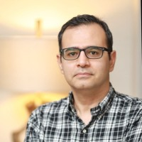
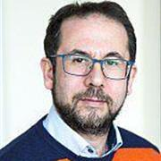
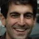
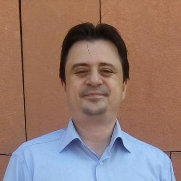

#+STARTUP: overview
#+TITLE: 7th Open-Source Computational Mechanics and Acoustics Workshop and Summer Camp
#+SUBTITLE: Program
#+AUTHOR: [[https://yeditepe.edu.tr/tr/akademik-kadro/180][Fethi Okyar]]
#+CREATOR: Fethi Okyar
#+LANGUAGE: en/tr
#+OPTIONS: num:nil toc:nil
#+ATTR_HTML: :style margin-left: auto; margin-right: auto;
#+HTML_HEAD: <meta name="referrer" content="no-referrer">

#+ATTR_HTML: :width 100px

*Administrative Staff:* Maya Çoban and Eren Kabarık

*Scientific Committee:* Asst. Prof. Mete Öğüç (Atlas University), Dr. Volkan Karadağ

Meeting Link: https://meet.jit.si/oscmw-2026 (External visitors should use the livestream links provided below.)

* Highlights:
** [[https://www.uttyler.edu/directory/mechanical-engineering/khajah.php][Prof. Tahsin Khajah]], University of Texas at Tyler, U.S.A.
Live on Thursday, Sep.3,2026, 21:30 (UTC+3). Stream Link: https://youtube.com/live/QVSjlPvpQKU?feature=share
#+ATTR_HTML: :width 100px
#+ATTR_REVEAL: :width 100px

** [[https://profiles.sussex.ac.uk/p390809-gianluca-memoli][Prof. Gianluca Memoli]], University of Sussex, U.K.
Live on Friday, Sep.4,2026, 12:00 (UTC+3). Stream Link: https://youtube.com/live/jFyYp6PjWXw?feature=share
#+ATTR_HTML: :width 100px
#+ATTR_REVEAL: :width 100px

** [[https://www.uu.se/en/contact-and-organisation/staff?query=N20-1797][Prof. Emek Abali]], Uppsala University, Sweden
Live on Friday, Sep.4,2026, 16:30 (UTC+3). Stream Link: https://youtube.com/live/f0Oabgj4XCI?feature=share
#+ATTR_HTML: :width 100px
#+ATTR_REVEAL: :width 100px

** [[https://avesis.marmara.edu.tr/emre.alpman][Prof. Emre Alpman]], Marmara University, Istanbul
Live on Saturday, Sep.5,2026, 15:00 (UTC+3). Stream Link: https://youtube.com/live/Gwd5hv_9Rxo?feature=share
#+ATTR_HTML: :width 100px
#+ATTR_REVEAL: :width 100px

* Workshop Calender:
** Thursday, Sep.03:
*** 11:00 Opening Workshop: Essentials for Beginners
- Speaker: Maya Çoban and Fethi Okyar
- Deliverables:
  1. Understanding linux, console, =zsh=, =ssh=, =python=, emacs, etc.
  2. Setting up a virtual Archlinux OS using virtualbox: See [[./visuals/2026/Vbox_archlinux_guide.pdf][Guide]]
  3. Maintaining your virtual Archlinux OS: [[https://mega.nz/file/2wQlBaRK#xfWCX_0xfUIRAn0mTJ8sRpxRqYasRd4YSyVpRN74SH0][download (~13GB)]]
  4. Using an editor: [[https://www.gnu.org/savannah-checkouts/gnu/emacs/emacs.html][emacs]]
  5. Emacs customization
*** 15:00 Workshop 2: =git= for Collaborative Research
- Speaker: Volkan Karadağ
  1. setting up user accounts, authentication by tokens
  2. accessing our github repo (mekanotrix)
  3. creating a new project
  4. branching and collaborative parallel workflow
  5. fetch, merge, pull cycle
*** 21:30 @@html:Seminar 1:@@ Iterative On Surface Radiation Conditions for Transmission Problem
- Speaker: Tahsin Khajah
- Livestream Link: https://youtube.com/live/QVSjlPvpQKU?feature=share
** Friday, Sep.04:
*** 10:00 Workshop 3: Essential Research Production Tools
- Speaker: Fethi Okyar
- Deliverables:
  1. Understanding typesetting in LaTeX (local install in console)
  2. Setting up a bibliographic databes with Zotero
  3. Using BibTeX to access the bibliography from LaTeX
  4. Using LaTeX on the cloud with Overleaf
*** 12:00 @@html:Seminar 2:@@ Metamaterials In Action
- Speaker: Gianluca Memoli
- Livestream Link: https://youtube.com/live/jFyYp6PjWXw?feature=share
*** 15:00 Workshop 4: CalculiX: an open-source FEA package
- Speaker: Maya Çoban
- Title: Calculix: An Essential Tool for Finite Element Analyses
- Deliverables:
  1. Installing and setting up CalculiX and dependencies in an Archlinux environment
  2. Using the documentation and discourse site for getting help
  3. Using =cgx= and =ccx= in a sample problem
  4. Understanding the CAD/FEA workflow, installing and setting up FreeCAD and Gmsh
*** 16:30 @@html:Seminar 3:@@ Advances in Computational Reality
- Speaker: Emek Abali
- Livestream Link: https://youtube.com/live/f0Oabgj4XCI?feature=share
*** 21:30 Workshop 5: A New Type of Analysis Framework: FenicS/Firedrake
- Speaker: Neşet Biçkin
- Deliverables:
  1. Working with containers, Docker, installing Fenics
  2. Introduction to solving PDE's with Fenics
  3. Using Paraview as an advanced post-processing tool
** Saturday, Sep.05:
*** 10:00 Workshop 6: Setting up a local LLM
- Speaker: Volkan Karadağ & Eren Kabarık
- Delverables:
  1. introduction to LLMs, weights, and transformers
  2. installing =ollama= as an application/service
  3. talkıng to an LLM, best practices
*** 15:00 Workshop 7: Getting the Topology Optimization Cycle into Work
- Speaker: Emre Alpman
- Livestream Link: https://youtube.com/live/Gwd5hv_9Rxo?feature=share
- Resources: https://dafoam.github.io/
- Deliverables:
  1. About setting up the OpenFoam package
  2. On the role of automatic differentiation in optimization
  3. Sample problems and their solutions
*** 21:30 @@html:Seminar 4:@@ Current Research in Metamaterials
- Speaker: Neşet Biçkin
- Livestream Link: https://youtube.com/live/IAZajQKs44c?feature=share
** Sunday, Sep.06:
*** 11:00 Workshop 8: Using Fenics from JupyterLab
- Speaker: Mete Öğüç
- Deliverables:
  1. How to install and use JupyterLab as a Docker container
  2. Using Fenics from JupyterLab
*** 15:00 @@html:Seminar 5:@@ On the Solution of Nonlinear Wave Propagation Problems
- Speaker: Tuğçe Sezer
*** 20:30 Dinner at Lunapark Restaurant
* Participants:
** Scientific Committee
- Asst. Prof. Dr. Mete Öğüç (Ph.D.,2023) Atlas Univ., BME Dept. (Chair)
- Dr. Volkan Karadağ (Ph.D.,2024), Yeditepe Univ., ME Dept. (Part-time Instructor)
** Campers:
- Neşet Biçkin (ME,2025), Yeditepe Univ., ME Dept. (Ph.D. Student)
- Pelin Özdemir (B.Sc.,2026), Yeditepe Univ., BME Dept.
- Adam Ruszczak (B.Sc.,2027), Military University of Technology in Warsaw, ME Dept.
- Eren Kabarık (B.Sc., 2027), Yeditepe Univ., ME Dept. (Broadcasting Manager)
- Maya Çoban (B.Sc.,2028), Yeditepe Univ., ME Dept. (Instructor)
- Baran Polat (B.Sc.,2028), Yeditepe Univ., ME Dept.
- Ömer Katrancı (B.Sc.,2028), Yeditepe Univ., ME Dept.
- Dağhan Nart (B.Sc.,2029), Yeditepe Univ., ME Dept.
- Eda Baba, High School Student
- Irmak Tuna, High School Student
* Lodging
** Camper Instructions:
For those who intend to bring their tents to stay in the camping area
- bisiklet, çadır, çarşaf, terlik, havlu, sinek ilacı, mayo
- günlük atıştırmalık, meşrubat, ve kahvenizi yanınızda getiriniz.

* Promo:
