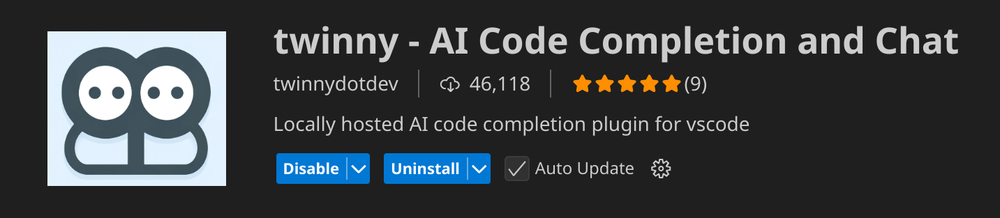
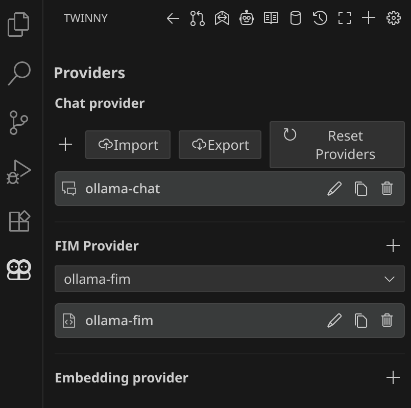
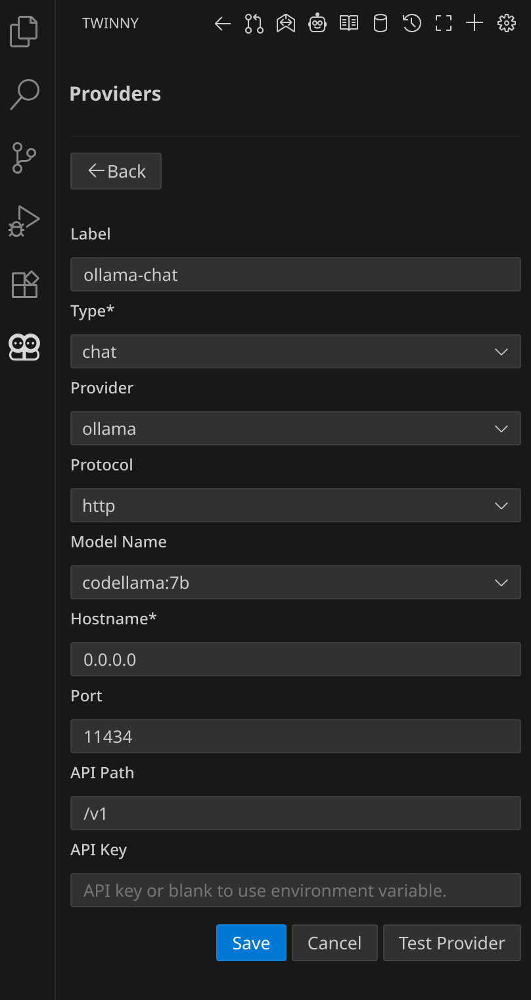
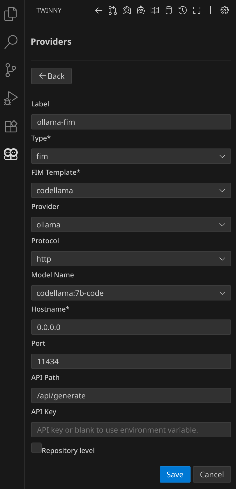
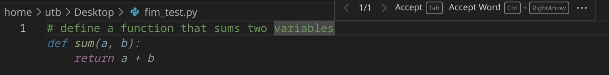
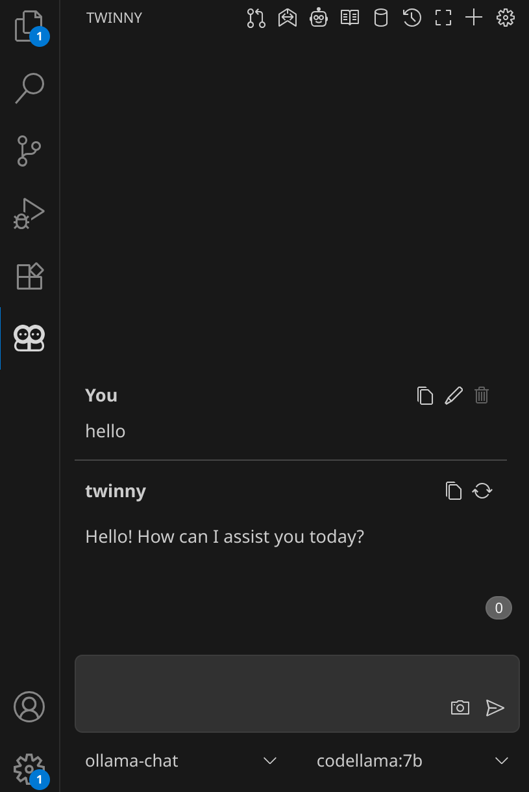

#+AUTHOR: Ufuk Tan Baler
#+TITLE: Session 8: Notes on Local AI Code Assistance and Selfhosting an Email Server

* Integrating a Local AI Model in VSCode
** Preliminaries
Install the below packages
- VSCode
- docker
- twinny extension

Docker containers are similar to virtual machines, but lighter on system resources, and specifically provide the dependencies for the distributed software. Ollama server is the software we are going to use inside a container.

Before running a container, it is feasible to create a shared folder in the host's filesystem. The shared folder enables us to link the host's and container's filesystems over itself. So, we could exchange model files with the container.

Let's create a shared folder,
#+BEGIN_SRC bash
mkdir ~/models
#+END_SRC

** Running the Ollama Server
We need to run the docker container in the background. For once execute the command below,
#+BEGIN_SRC bash
sudo docker run -d -v ~/models:/root/models -p 11434:11434 --name oscmw-ollama ollama/ollama
#+END_SRC
where
- ~-d~: runs the container in background and print the container ID
- ~-v~: binds mount the volume
- ~-p~: publishes the container's port to the host
- ~--name~: assigns the name to the container
- ~ollama/ollama~: the image name

If ~ollama/ollama~ image hasn't been downloaded before, it will be downloaded.

Now, we can check running containers by
#+BEGIN_SRC bash
sudo docker ps -a
#+END_SRC

We should see something like this,
#+BEGIN_SRC text
CONTAINER ID   IMAGE           COMMAND               CREATED         STATUS                  PORTS                                             NAMES
58c9cf508d0d   ollama/ollama   "/bin/ollama serve"   2 minutes ago   Up 2 minutes            0.0.0.0:11434->11434/tcp, [::]:11434->11434/tcp   oscmw-ollama
#+END_SRC
The container has been successfully up and running about two minutes. Notice the ~COMMAND~ column where it says ~"/bin/ollama serve"~. The container is actually default to running ollama in the serve (server) mode. Therefore, ollama server is running, and can be accessed through the port.

In order to download LLM models using ollama binaries, we need to access the shell of the container. Let's issue the command in host machine,
#+BEGIN_SRC bash
sudo docker exec -it oscmw-ollama /bin/bash
#+END_SRC
which executes ~/bin/bash~ program inside the container, and the result should be a shell prompt where we are seen as the root user,
#+BEGIN_SRC bash
root@58c9cf508d0d:/#
#+END_SRC

If we go to ~/root~ (models), the shared folder can be seen in the container,
#+BEGIN_SRC bash
root@58c9cf508d0d:/# cd /root/
root@58c9cf508d0d:~# ll
total 8
drwx------ 1 root   root     72 Sep 14 11:15 ./
drwxr-xr-x 1 root   root      8 Sep 14 11:15 ../
-rw-r--r-- 1 root   root   3106 Apr 22  2024 .bashrc
drwxr-xr-x 1 root   root     60 Sep 14 11:15 .ollama/
-rw-r--r-- 1 root   root    161 Apr 22  2024 .profile
drwxr-xr-x 1 ubuntu ubuntu    0 Sep 14 10:17 models/
#+END_SRC

Now, we need specifically chat, and FIM (fill-in-the-middle) capable models which are going to be run in the server. https://ollama.com/search helps us to browse the models. In this tutorial we could consider 7-billion parameter codellama models. They are
- codellama:7b
- codellama:7b-code
which are used for chat, and FIM, respectively.

We pull the models one by one (wait for the first pull to finish then pull the other model),
#+BEGIN_SRC bash
root@58c9cf508d0d:~# ollama pull codellama:7b-code
root@58c9cf508d0d:~# ollama pull codellama:7b
#+END_SRC

We check the downloaded models,
#+BEGIN_SRC text
root@58c9cf508d0d:~# ollama list
NAME                 ID              SIZE      MODIFIED
codellama:7b-code    8df0a30bb1e6    3.8 GB    9 days ago
codellama:7b         8fdf8f752f6e    3.8 GB    9 days ago
#+END_SRC

** Editor Setup
Install twinny in VSCode extensions,
#+ATTR_HTML: :width 500px

Once it is installed let's click on the robot head in twinny's dash. We will add new providers such that it will look like this,
#+ATTR_HTML: :width 300px

The configurations for chat, and fim providers are shown, respectively,
#+ATTR_HTML: :width 300px

#+ATTR_HTML: :width 300px

Restart VSCode and open a test file called ~fim_test.py~. Write a simple problem definition as a comment,
#+ATTR_HTML: :width 600px

Type something in the chat window as well,
#+ATTR_HTML: :width 300px

It works!

** Tips
** Converting GGUF Files to Ollama Models
The local GGUF file should be moved to the shared folder first. Then, follow https://github.com/ollama/ollama#import-from-gguf.

Note that the ~Modelfile~ should be created inside the shared folder.

** Model Memory Timeout
Search for Twinny: Keep Alive in VSCode settings. You may change it according to your preference.

** Toggle Completion
You might use ~Alt+\~ combination to send your FIM request to the server. Uncheck Twinny: Auto Suggest Enabled in VSCode settings.

** Resources
1. https://github.com/ollama/ollama
2. https://ollama.com/
3. https://github.com/twinnydotdev/twinny
4. https://twinnydotdev.github.io/twinny-docs/

* A Somewhat Basic Tutorial on Setting up a Web and Email Server
** Warning!!!
Original tutorial is https://www.youtube.com/watch?v=3dIVesHEAzc. All the content here is all written notes based on the link given. This written tutorial has no responsibility of any damage, and risk. Use it with your own responsibility.
** For the reader
For example if your domain is ~dummy.net~, replace ~---~ or ~landchad~ with ~dummy~ in all examples.
** Get a domain name
- epik
** Find a machine
- vultr
  + enable IPv6
  + server hostname & label: ~---.net~ (obtained from epik)

** Set DNS host records (epik)
- copy the IP address from vultr
- go to External Hosts (A, AAAA) records
- delete all stuff there
- add a record
  + leave Host blank, paste the IP address in Points to    
- add a record
  + put www in Host, paste the IP address in Points to    
- add a record
  + put * in Host, paste the IP address in Points to
- go to the server's settings on vultr find IPv6 address
- add three IPv6 records, and do the same thing before
- go to the Email Services (MX)
- add a record
  + Priority: 10, Host: blank, Points to: ~mail.---.net.~
- save it  
Note: TTL is kept 300

** ssh into ~root@---.net~
- they give you a password
- ~gpg --full-gen-key~ to generate a key
- ~ssh-copy-id root@---.net~ to copy the generated key to the server
then connect to the server using the gpg key.

disable password login:
- edit ~/etc/ssh/sshd_config~
  + make ~UsePAM no~
  + make ~PasswordAuthentication no~
- systemctl reload sshd      

** Preliminaries
- apt update
- apt upgrade
- edit .bashrc if you want    
    
** Reverse DNS record (vultr)
- go to the server's settings
- go to IPv6
- copy the IPv6 address and put it into an empty record then type ~---.net~, then add    
** Installation of packages
Install
- nginx
- python-certbot-nginx (it gives https)
- rsync

** Configuration
Let's first configure nginx of the website
#+BEGIN_SRC bash
cp /etc/nginx/sites-available/default /etc/nginx/sites-available/landchad # web site
#+END_SRC

Edit ~/etc/nginx/sites-available/landchad~
- comments can be deleted if you want

#+BEGIN_SRC bash
server {
    listen 80;
    listen [::]:80;

    root /var/www/landchad;

    index index.html index.htm index.nginx-debian.html;

    server_name landchad.net www.landchad.net;

    location / {
	try_files $uri $uri/ =404;
    }
}
#+END_SRC

Let's configure nginx of the mail
#+BEGIN_SRC bash
cp /etc/nginx/sites-available/landchad /etc/nginx/sites-available/mail # mail site
#+END_SRC

Edit ~/etc/nginx/sites-available/mail~

#+BEGIN_SRC bash
server {
    listen 80;
    listen [::]:80;

    root /var/www/mail;

    index index.html index.htm index.nginx-debian.html;

    server_name mail.landchad.net www.mail.landchad.net;

    location / {
	try_files $uri $uri/ =404;
    }
}
#+END_SRC

Enable (activate) the sites by symbolic linking
#+BEGIN_SRC bash
ln -s /etc/nginx/sites-available/landchad /etc/nginx/sites-enabled/
ln -s /etc/nginx/sites-available/mail /etc/nginx/sites-enabled/
#+END_SRC

Refresh nginx
#+BEGIN_SRC bash
systemctl reload nginx
#+END_SRC

Create an html file for the website: /var/www/landchad/index.html
#+BEGIN_SRC bash
<h1>This is a landchad site~</h1>
#+END_SRC

** Getting https
#+BEGIN_SRC bash
cerbot --nginx
#+END_SRC

Press enter to https all the given stuff.

Redirect sites by pressing 2.

** Setting up the mail server
Download a script by
#+BEGIN_SRC bash
curl -LO lukesmith.xyz/emailwiz.sh
#+END_SRC

It sets up postfix dovecot server spam-assasin
+ postfix: sends the email
  - System mail name: landchad.net
+ dovecot: downloads the email    
+ spam-assasin: blocks spams
+ dkim: service for validating the emails for sending emails to google etc.

** Putting text records
- Go to epik dns records -> TXT Records (TXT)
- add a record
- Host is @      
- open ~~/dns_emailwizard~
- copy ~v=spf1 mx ... -all~ paste it into TXT Value
- add a record
- Host is ~_dmarc~
- copy ~v=DMARC1; ... fo=1~ paste it into TXT Value
- add a record
- Host is ~mail._domainkey~
- copy ~v=DKIM1; ...~ paste it into TXT Value
Note:
- Priority is 0, TTL is 300 for all the records.
- ~...~'s are actual texts written in ~~/dns_emailwizard~.

** Add user
Here we added a user called ~chad~. It is the username that you choose. Basically, when you email ~chad~, you would type ~chad@landchad.net~.
#+BEGIN_SRC bash
useradd -G mail -m chad
passwd chad
#+END_SRC
